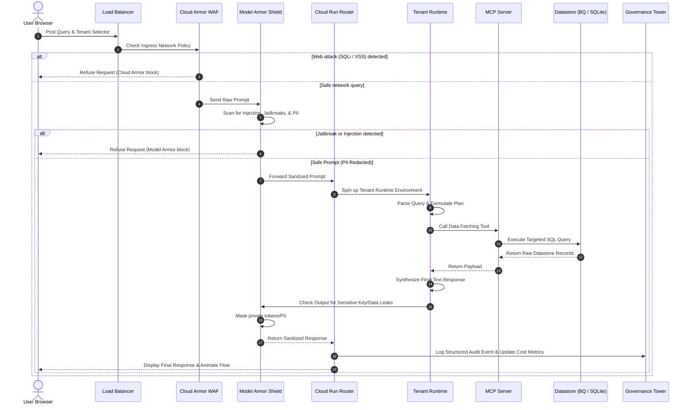

# Technical Architecture: GCP Multi-Tenant Agent Security Gateway (MAG)

This document specifies the technical architecture, component breakdown, and runtime data flow sequence of the Multi-Tenant Agentic Security Gateway application.

---

## 🏗️ System Components

The application is structured into four decoupled layers, providing network protection, input safety, tenant isolation, and centralized auditability:

```mermaid
graph TD
    User["Client Browser (Console & UI)"] -->|1. User Prompt| ALB["External Application Load Balancer"]
    
    subgraph Routing Hub (Ingress)
        ALB -->|2. Ingress Check| CA["Cloud Armor (WAF Checks)"]
        CA -->|3. Prompt Sanitization| MAP["Model Armor (Prompt Shield)"]
        MAP -->|4. Route Request| CR["Cloud Run (FastAPI Router)"]
    end
    
    subgraph Tenant Runtimes (Isolated Boundaries)
        CR -->|5a. Route Tenant A| TA["Tenant A Runtime (Fusion AI)"]
        CR -->|5b. Route Tenant B| TB["Tenant B Runtime (FinCorp)"]
        
        TA -->|6a. Secure RAG Tool| MCPA["MCP Server A"]
        TB -->|6b. Secure RAG Tool| MCPB["MCP Server B"]
        
        MCPA -->|7a. SQL Queries| BQ[("GCP BigQuery (fusion_ai)")]
        MCPB -->|7b. SQL Queries| SQ[("SQLite Database (fincorp.db)")]
        
        TA -->|8a. Format| MAE["Model Armor (Egress Shield)"]
        TB -->|8b. Format| MAE
    end
    
    subgraph Central Governance & Observability
        MAE -->|9. Sanitized Output| CR
        CR -->|10. Telemetry & Logs| GT["Governance Tower (Audit Logging)"]
        GT -->|11. Event Feed| User
    end
```

---

## 💻 Tech Stack & Interfaces

*   **Frontend Interface**: Single Page Application (SPA) designed using **HTML5**, **CSS3 (Vanilla)** with a glassmorphism theme, and **JavaScript (Vanilla)** to orchestrate state, trigger sequence flow animations, and update live charts using **Chart.js (v4.x)** via CDN.
*   **Application Server**: **FastAPI (v0.110.0)** running on **Uvicorn (v0.28.0)** web server. Exposes asynchronous endpoints (`/api/query`, `/api/stats`, `/api/logs`, and `/api/reset`).
*   **Datastores**:
    *   **GCP BigQuery**: Remote warehouse queried by the **google-cloud-bigquery (v3.18.0)** client.
    *   **SQLite**: Local transactional file database containing stock forecast values and market headlines.
*   **Auth Layer**: Simulates **Identity-Aware Proxy (IAP)**, passing a JWT-authenticated context payload containing the email (`be*******@gmail.com`) and project ID (`beth-*****`) headers.

---

## 🔄 Request-Response Lifecycle Sequence

When a query is submitted, it traverses the system through the following sequence:



---

## 🛡️ Security Policies Configuration

The gateway enforces the following automated security rules:

### A. Network Security (Cloud Armor)
*   **SQL Injection Shield**: Scans strings against SQL pattern variations: `UNION SELECT`, `' OR '1'='1`, `--`.
*   **Cross-Site Scripting (XSS) Shield**: Blocks query terms containing `<script>`, `javascript:`, or `onload=` tags.
*   **Path Traversal Shield**: Blocks relative path injections like `../../` or `/etc/passwd`.

### B. LLM Security (Model Armor Ingress)
*   **Prompt Injection Regex Check**: Detects combinations of override verbs and instruction nouns separated by any words: `(ignore|bypass|override).*(instructions?|rules?|guidelines?)`.
*   **System Disclosure Regex Check**: Detects reveal verbs combined with system settings or credentials: `(reveal|print|show|dump).*(system\s*(prompts?|instructions?)|credentials?|passwords?)`.
*   **Role Elevation Regex Check**: Stops privilege escalation: `(set|change|act\s+as).*(admin|root|superuser)`.
*   **PII Masker**: Detects and replaces emails, credit cards, and phone numbers with `[REDACTED_*]` placeholders.

### C. LLM Security (Model Armor Egress)
*   **API Key Scanner**: Detects outbound private tokens (`AIzaSy...`, `sk_live_...`, `SG.`) and redacts them prior to client delivery.
